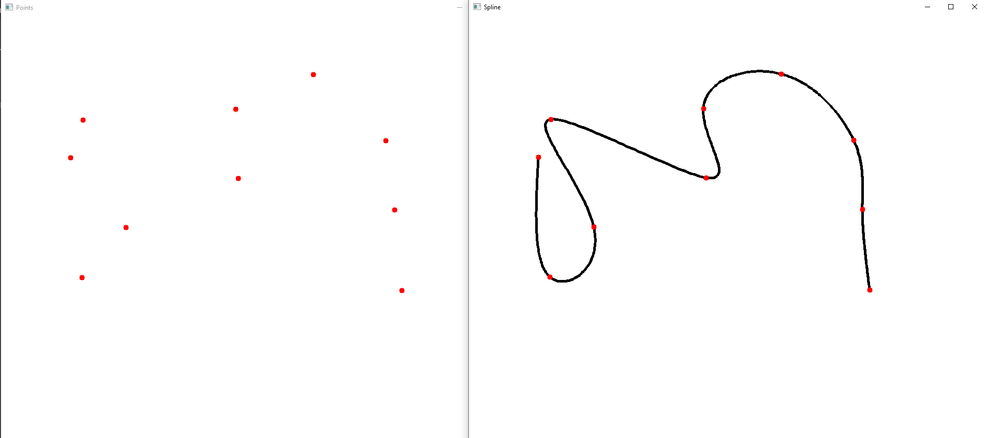

## КОНТРОЛЬНА  РОБОТА  2  “СПЛАЙНИ”
___
## Загальна умова:
Вершини для першого та другого завдання містяться у відповідних json [файлах](https://drive.google.com/drive/folders/1cSKaN-fx76q-tVbDalyIr1Xi3RO0BPtY?usp=share_link ). Назва файлу відповідає номеру варіанта.
Json файл з даними складається:
- “curve” - список 2D точок для побудови кривої
- “surface” -> “gridSize” - розмір сітки. У всіх варіантах (13 x 13)
- “surface” -> “points” - одновимірний список 3D точок розміром 169. Кожна точка має індекс рядка та стовпчика в сітці (13 x 13), які записані в списку “surface” -> “indices”. 
___
### Варіант 1
1. Для заданої [множини](https://drive.google.com/file/d/14hjFFFFXOgRSO4QrWvxpljt20EuCj7-i/view?usp=share_link) контрольних точок на площині:  
Побудувати сплайн Безьє:  

___
2.  Для заданої множини контрольних точок у просторі (13x13 points):  
Побудувати поверхню NURBS:  
50x50 точок, кубічні базисні сплайни, ваги від 0 до 1:
  
___
Виконав студент 4-го курсу групи ІПС-41, ФКНК, КНУ, Баликов Антон.